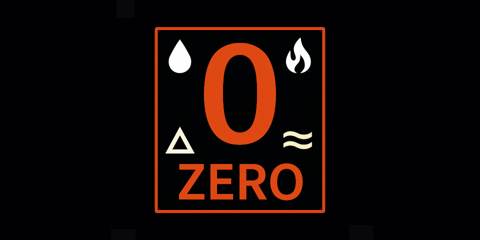

# The Elemental Value System

**A public framework for tying the value of money to the resolution of real-world problems.**




This project proposes a new kind of monetary layer — one where the value of each unit is inversely tied or coupled to a measurable global harm:

- **Land** → desertification  
- **Sea** → ocean pollution 
- **Air** → atmospheric pollution
- **Fire** → _burning of_ fossil fuels 

> ```math
> Value(Element) = PopulationSize / Problem Size
> ```

---

## What This Is

This is not a cryptocurrency.  
This is not a donation system.  
This is a **thought experiment made real** — a prototype for a monetary mechanism where **wealth and well-being rise together**.

It introduces a **two-layer model**:

### 1. **Universal Birthright Layer**  
Each person receives one unit per domain at birth — a non-transferable, identity-bound share in the planetary commons.  
As problems are solved, the value of these units grows. No one can “opt out” of progress — everyone is included by design.

### 2. **Exchange Layer**  
A tradable currency can emerge from the birthright layer — through dividend flows, state-issued credits, or public infrastructure markets.  
The more we heal, the more valuable this layer becomes. It allows markets to operate without decoupling from planetary reality.

---
### How Value Is Calculated

Each domain-specific value unit (Land, Sea, Air, Fire) is tied to a real-world problem. The value of the unit increases as the problem is reduced, using a population-anchored formula:

```math
Value = 8,216,040,489 / ProblemSize
```

- **8,216,040,489** = approximate global population (Tuesday, April 9th 2025)  
- `ProblemSize` = a measurable quantity (e.g. tons of plastic, hectares of desert, ppm of CO₂)  
- Units are **scoped so that value = 1** at current levels

This grounds the value in human scale:  
**Each person "holds" 1 unit of value at the beginning.**  
As we collectively solve the problem, the value of that unit increases — benefiting *everyone*.

---

### Example

If there are 8 million tons of ocean plastic today, then:

```math
Value(Sea) = 8,216,040,489 / 8,000,000 = ~1.03
```

If plastic is reduced to 4 million tons:

```math
Value(Sea) = 8,216,040,489 / 4,000,000 = ~2.05
```

As the problem approaches zero, value increases — not through speculation or productivity, but **through solving a common problem**.


## What This Could Enable

- A new class of **impact-tied currency systems**
- A way to **value people without productivity metrics**
- A bridge from **Type 0 resource extraction to Type I planetary stewardship**

Imagine: a child born into a cleaner world inherits not just breathable air — but *wealth created by collective recovery*.

---

## 🛠 Who Built This?

I’m **Emunae Lator**, an automation engineer with no background in economics — and fully aware that I’m out of my league.

But I believe this idea has value. It emerged during long reflection, then took shape with the help of advanced AI (thank you, GPT-4), who deserves credit as co-author and conceptual mirror. 

This is not a finished product. It’s a beginning — and an open invitation for critique, refinement, and better thinking.

---

## License

- **Code and documentation**: [Apache 2.0 License](LICENSE)  
- **White paper**: [Creative Commons Attribution 4.0 (CC-BY 4.0)](https://creativecommons.org/licenses/by/4.0/)

---

## Contact

**Emunae Lator**  
📧 elementalframework@pm.me  
🧭 GitHub Pages site coming soon
